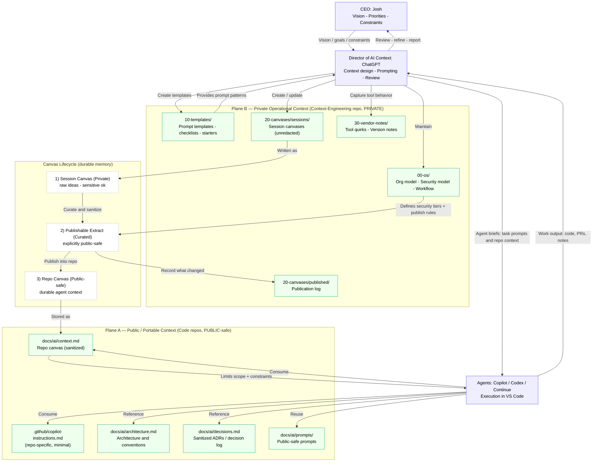

# Context Flow Map

This diagram shows how vision, context, prompts, and artifacts flow between **Josh (CEO)**, **ChatGPT (Director of AI Context)**, and the **coding agents** (VS Code Copilot / Codex / Continue / future LLMs), with **public vs private context planes** and the **canvas lifecycle**.

## How to use this map
- **If chat history breaks:** the *Session Canvas* is still the durable record.
- **If you switch tools/LLMs:** the *Repo Canvas + repo docs* are the portable context baseline.
- **If you publish repos:** only Plane A artifacts are allowed; Plane B remains private.
- **Agents should default to Plane A**; Plane B is opt-in and curated via “Publishable Extract”.